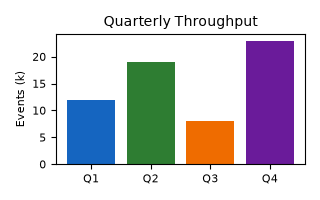

# Relative Image References

These images use **relative paths** and must resolve against the directory that
contains this Markdown file.

A PNG in an `images/` subdirectory:

An SVG in the same `images/` subdirectory:

A parent-relative reference using `../`. This points up one directory and back
into an `images/` folder. Whether it resolves depends on where the file is
served from; it is included to exercise `../`-style path handling:

If the first two images appear but the third is broken, that is expected when
this file sits at the top of the served directory — the point is that the
renderer attempts resolution relative to the document, not against a remote host.
