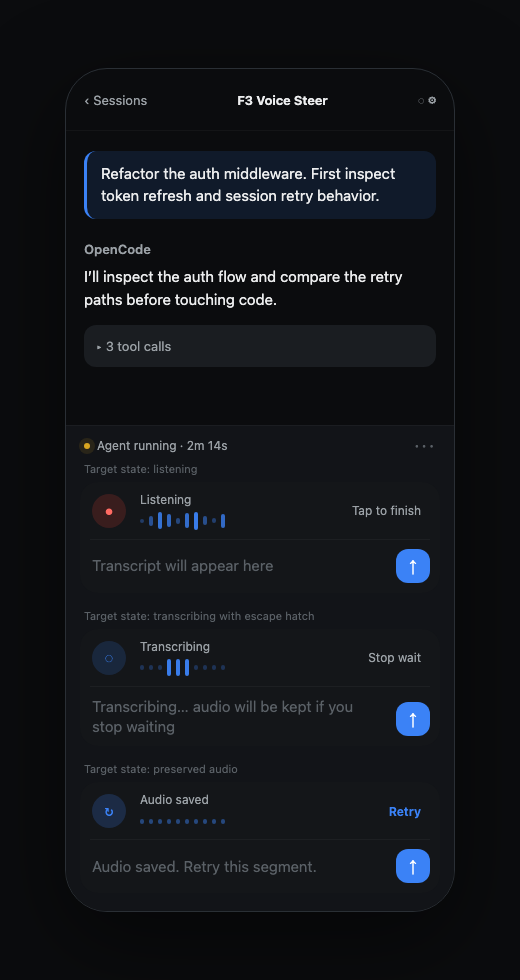
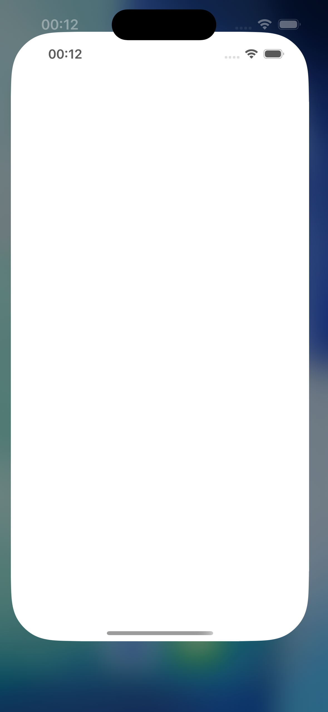

# F3 · 语音 composer 控制模型改动规格

本文是 F3 的改动规格，可以独立读懂。一句话：**OpenCode iOS Client 是一个 Steer 终端，语音 composer 是用户远离键盘时介入 AI 工作的主控台；语音是主模态，文本输入是审阅和修正模态，agent interrupt 是低频逃生口。F3 要把 voice rail 做成 composer 的主控面，同时把转写恢复和 agent 中断拆开，避免用户在高频语音 steer 时被低频破坏性动作抢走注意力。**

文末附“关键事实”速查，供实现时核对 ASR 引擎、stall 成因、控件清单和状态变量。

---

## 一、产品前提

PRD 对这个 App 的定位不是移动端代码编辑器，也不是状态监控器，而是 OpenCode 的移动端 Steer 终端。AI 在 Mac/Server 上执行和探索，人类在 iPhone/iPad 上阅读 Markdown 报告、审查方向、用语音快速纠偏。语音输入的价值不是“更方便地输入文字”，而是在离开键盘时仍然能低摩擦地下达方向性指令。

这决定了 F3 的设计目标：它不是 UI polish，而是控制模型修正。用户打开 App 时通常在多线任务中切换，可能正在读 AI 的分析、判断是否偏航、同时准备下一条语音指令。主路径是口述一句、扫一眼转写、直接发送。中断 agent 只在发现 agent 正在做明显错误、浪费时间或有副作用的事情时才会发生。这个频率差必须体现在信息层级里：语音控制应该显眼、稳定、顺手；agent interrupt 应该存在，但不能像全局警报一样压在聊天顶部。

F3 要降低三类 cognitive burden：

第一，控制对象负担。每个控制必须让用户一眼知道它控制的是语音采集、转写等待、转写恢复，还是 agent 运行。

第二，失败恢复负担。长段口述卡住是常态，不是边缘错误。当前实现已经有主动出口：转写等待时左侧红色方块会强行中断当前 WebSocket/finalize 等待，并保留音频给用户重试。F3 要改的不是“补一个出口”，而是把这个出口的语义讲清楚，不再让它和 agent 中断共用同一个 stop 图标。

第三，并行状态负担。agent 在跑时，用户仍然可能要继续口述下一条 steer 指令；composer 不能因为 agent busy 就变成只能中断、不能输入的运行模式。

第四，注意力层级负担。`state.isBusy` 是常态，不是警报。把“中断 agent”做成顶部大 banner，会把一个低频动作提升成页面第一视觉焦点，反而违背 Steer 产品的主路径。更好的方向是把 AI 运行状态降为安静状态行，把 interrupt 做成可发现但不抢眼的 escape hatch。

设计语言遵守 `docs/design.md` 的 Quiet Tech 约束，但本轮要修正一个优先级：`docs/design.md` 里早期把 mic 放进输入框内部，把 stop 放在 send 上方，是“打字为主、语音为辅”的 composer 设定；F3 的用户路径已经反过来，语音是主模态。新的 composer 应该采用“voice rail + text review field”的结构：voice rail 在上方，带 waveform 和语音状态；文本框在下方，承接转写、人工修正和发送。稳定按钮不换位仍成立，只是稳定槽位从左右两个小按钮升级为上方 voice rail 的 transport 控件。

---

## 二、要解决的问题

composer 上现在有两套状态机：

- **Capture/Transcribe**：录音、停录、等待服务端 finalize、卡住后 abort 保存音频、retry 重转同一段。
- **Run/Agent**：发送消息、agent 运行、用户中断正在跑的 agent。

问题不是它们同屏共存本身，而是控件语义混在一起。

当前最明显的问题是两个红色 `stop.fill`：一个在左侧 mic 轨道，停的是语音转写等待；一个在右侧 send 轨道，停的是正在跑的 agent。它们同字形、同颜色，只靠左右位置区分。更关键的是，它们并不可靠互斥：代码允许 agent busy 时继续录音，用户停录后进入 `isTranscribing`，这时 `state.isBusy` 仍可能为真，于是两个红色 stop 可以自然同屏。用户看到两个同形同色 stop 时，需要靠位置记忆和当前上下文推断：左边停转写等待，右边停 AI inference。

另一个问题是主动出口的语义不清。停录后客户端等待服务端 finalize，最长可能卡到 30 秒超时；当前 UI 在左侧提供了红色方块，点击后会强行中断当前 WebSocket/finalize 等待，并给用户重试同一段音频的机会。这条恢复路径是对的，问题在于它看起来和右侧“中断 agent/session”的红色 stop 几乎一样。上一版设计文档如果只显示“正在转写”而没有主动退出等待的出口，就会退化成更差的体验；F3 不能丢掉当前已有的主动出口，而要把它重新命名、重新定位、重新解释。

目标是：用户任何时刻都能回答三个问题，而且不用多想。

第一，我现在是在录音、等转写、审阅文本，还是 agent 在跑。

第二，我按这个按钮会停什么。

第三，如果转写卡住，我能不能马上退出等待，并且保住刚才那段音频。

---

## 三、控制模型

采用“voice rail 主控 + text review field + quiet run status”的结构。

这个方向来自 UI Design Judgment skill 的两条判断。第一，先按任务成功定义界面：F3 的主任务是让用户低摩擦口述下一条 steer 指令，而不是让用户随时盯着中断按钮。第二，用物理产品类比锚定视觉：这里更像一个嵌入开发者工具里的数字录音机，而不是一个表单输入框。物理录音机会把 transport control、录音状态和电平反馈放在最顺手的位置；它不会把 emergency stop 做成最大、最显眼的常驻控件。

### 1. Voice rail：上方，主模态

voice rail 放在文本框上方，是 composer 的第一行，也是语音主控面。它负责开始录音、结束录音、显示 waveform、等待转写、取消等待、重试刚才那段。

rail 由三部分组成：左侧 transport button，中间 waveform/status，右侧可选的轻量状态或 retry/取消动作。transport button 是稳定槽位，不随状态左右漂移。waveform 是主反馈，不是装饰：录音中直接消费 `VoiceFlowMicrophone.audioLevel` 的真实 mic level，转写中显示低频 traveling pulse，preserved-audio 状态显示静态 retained waveform 或短横线。用户看一眼就知道“App 正在听我”还是“App 正在处理刚才那段”。

方向 mock（HTML artifact 截图，锁定信息层级，不是像素级稿）：



录音中，点击 transport button 是“停录并开始转写”。这里仍然不使用 `stop.fill`，因为这是正常结束采集，不是 abort。可以用红色 mic / pause-like control / filled recording dot，最终 hi-fi 定稿，但语义必须属于语音采集。

转写等待中，rail 内保留主动出口，文案是“停止等待”或“取消转写”。这个动作的真实语义是：**停止等待服务端 finalize，保留已录音频，进入可重试状态**。它不是中断 agent，也不是丢弃整段录音。

取消后，rail 内出现 retry（`arrow.clockwise` + “重试这段”），对应当前 `retryPreservedSpeechAudio()`：用 bulk API 重转同一段已保存音频。

### 2. Text review field：下方，审阅和发送

文本框放在 voice rail 下方。它不是主入口，而是转写结果的审阅区和 fallback 打字入口。默认 placeholder 可以仍是 `Ask anything...`，但在语音状态下应该承接语音语义，例如“转写会出现在这里”“音频已保留，可重试”。

send 保持在文本框右侧固定槽位。即使 agent 正在跑，send 也保留，因为服务端支持 busy 时将消息入队，且 Steer 场景里用户常常要在 agent 运行期间追加下一条方向指令。

### 3. Quiet run status：低频 agent interrupt

agent 运行状态需要可见，但不应该成为页面第一视觉焦点。`state.isBusy` 是常态工作状态，可以用一条安静的 run status 表达：例如 composer 上缘或消息流底部附近的一行 meta 文案 “Agent running · 2m 14s”，配一个 gold 小脉冲点。这符合 `docs/design.md` 里 gold 只用于 AI 工作中的约束。

interrupt 是这条 run status 的二级动作：可以是文字按钮“Interrupt”、长按/二次确认动作、或 `ellipsis` 菜单里的 `Interrupt agent`。它必须可发现，不能藏到用户找不到；但它的视觉权重应低于 voice rail 和 send。用户绝大多数时候会继续录下一条，而不是终止上一条。

这一步仍然消除语义重载：agent interrupt 和语音取消不共用裸 `stop.fill`，也不出现在同一个高频 transport 轨道里。但它不再用顶部 banner 抢焦点。

---

## 四、最终用户体验

### idle（空闲）

```
┌─────────────────────────────────────────────┐
│ ●  Tap to speak     ─ ─ ─ ─ ─ ─ ─ ─ ─       │  ← voice rail
│ [ Ask anything…                         ] ⬆ │  ← text review field
└─────────────────────────────────────────────┘
```

voice rail 是第一视觉入口。左侧 transport 静默，中央 waveform 区用非常轻的基线或短 dash 表示可录音。文本框仍可打字，但不是主视觉焦点。点 voice rail / transport 开始录音。

### listening（采集中）

```
┌─────────────────────────────────────────────┐
│ 🔴  Listening      ▂▃▆▇▅▂▃▆▅▂          │
│ [ 转写会出现在这里                    ] ⬆ │
└─────────────────────────────────────────────┘
```

voice rail 显示实时 waveform，成为“正在听”的主要证据。再次点击 transport = 停录并开始转写。这一步是正常完成采集，不是 abort。不要把它画成和 agent 中断一样的 `stop.fill`。

### transcribing（等待转写，可主动退出等待）

```
┌─────────────────────────────────────────────┐
│ ◌  Transcribing   ▂ ▂ ▂ ▂ ▂      Stop wait │
│ [ 正在转写…                        ] ⬆ │
└─────────────────────────────────────────────┘
```

停录后进入 finalize 等待，voice rail 从实时 waveform 切到 processing waveform。这个阶段可能和 agent-running 同时发生：用户正在等语音转写，同时上一条 agent 仍在跑。rail 内保留当前已有主动出口，但改成更明确的语义：建议文案为“停止等待”或“取消转写”，配 `xmark` / `mic.slash` / 小型 stop 变体均可，但不要复用 agent 的裸 `stop.fill`。点击后调用现有保留音频的 abort 路径，停止等待服务端，并进入 preserved-audio 状态。

这里的关键是心理模型：用户不是在销毁刚才的录音，而是在结束一次卡住的服务端等待。按钮附近或输入框内要有短文案说明“音频会保留，可重试”。

当前实现截图（用于本 PR 审核，展示 voice rail + quiet run status）：


### stalled / preserved-audio（已退出等待，可重试）

```
┌─────────────────────────────────────────────┐
│ ↻  Audio saved    ▂▂▂▂▂▂▂        Retry    │
│ [ 音频已保留，可重试                ] ⬆ │
└─────────────────────────────────────────────┘
```

用户主动取消等待，或系统到达 30 秒 finalize 超时后，都进入这个状态。文案要稳定、低压力，不要像 crash error。推荐表达：“转写已停止，刚才的音频已保留”“点左侧重试这段”。retry 调用 `retryPreservedSpeechAudio()`，重转同一段音频。

如果需要一个更短的小屏文案，用：“音频已保留，可重试”。

当前实现截图（用于本 PR 审核，展示 voice rail + preserved-audio retry）：



### transcript-ready（文本就绪，可编辑）

```
┌─────────────────────────────────────────────┐
│ ●  Tap to speak     ─ ─ ─ ─ ─ ─ ─ ─ ─       │
│ [ 重构认证中间件，先看 token 刷新       ] ⬆ │
└─────────────────────────────────────────────┘
```

转写结果落进可编辑输入框，mic 回静默。用户扫一眼、手改、发送。这是 PRD 里的 Steer 输入闭环：口述指令、审阅转写、发给 agent。

### agent-running（agent 在跑，composer 仍可输入）

```
   ……（对话流）……
┌─────────────────────────────────────────────┐
│ · Agent running · 2m 14s              ⋯     │  ← quiet run status
│ ●  Tap to speak     ─ ─ ─ ─ ─ ─ ─ ─ ─       │
│ [ 可以继续口述下一条指令…             ] ⬆ │
└─────────────────────────────────────────────┘
```

agent 在跑时，composer 不切到“运行模式”，也不隐藏 voice rail/send。用户仍然可以口述下一条方向指令，发送后由服务端队列处理。运行状态用一行低权重 meta 表达；`⋯` 或低权重文字按钮提供 `Interrupt agent`。interrupt 需要可发现，但不能比 voice rail 更像主任务。

---

## 五、要改的东西

每条写清现状、改法和文件落点。

**1. composer 改成 voice rail + text review field。**

现状：语音只是输入框左右按钮体系的一部分，视觉权重接近“附加输入方式”。当前 PR 实现又把 agent interrupt 提到对话流顶部，导致低频动作的视觉权重超过高频 voice steer。

改成：composer 采用两行结构：上方 voice rail，下方 text review field。voice rail 承载 transport、waveform、语音状态和 retry/stop-wait。text review field 承载转写文本、打字修正和 send。

文件：`ChatTabView.swift` 的 composer 区域；如需要拆分，可新增 `VoiceRailView`，但优先保持实现小而清楚。

**2. voice rail 加真实 waveform 状态反馈。**

现状：录音/转写主要靠 icon 和 placeholder 表达，用户缺少“它正在听我/处理我刚才那段”的物理反馈。

改成：录音中显示由 `VoiceFlowMicrophone.audioLevel` 驱动的实时 waveform；转写中显示 indeterminate traveling pulse；preserved-audio 显示 retained waveform 或静态条。waveform 服务任务状态，不做装饰性频谱秀，动效轻、短、低饱和，遵守 Quiet Tech。

文件：`ChatTabView.swift`；`ChatTabView+VoiceInput.swift` 负责启动/停止 `audioLevel` stream consumer。

**3. transcribing 阶段保留主动出口，但放在 voice rail 内。**

现状：停录后进入 finalize 等待，左侧已有红色方块作为主动出口；点击后会中断当前 WebSocket/finalize 等待，保留音频并给 retry 机会。问题是它和右侧 agent 中断图标高度相似，用户只能靠位置区分；而且 agent busy 与转写等待可以自然并行，因此两个 stop 可以同屏出现。

改成：转写等待期 voice rail 显示“Transcribing”和 processing waveform，并保留这个主动出口，但把它表达为“停止等待/取消转写”。点击后仍走现有 abort-preserving-audio 路径，停止等待服务端，保留音频，进入 retry 状态。F3 不改变这条恢复能力，只消除它和 agent 中断的图标重载。

文件：`ChatTabView+VoiceInput.swift` 的事件消费与状态设置；`ChatTabView.swift` 的 composer 阶段展示。

**4. preserved-audio 状态显式展示 retry。**

现状：`preservedSpeechAudio` 和 `retryPreservedSpeechAudio()` 已存在，但 UI 语义容易被理解成重新说或普通错误恢复。

改成：取消等待或超时后，voice rail 明确显示“音频已保留，可重试”；rail 内显示 `arrow.clockwise` + “重试这段”。retry 是重转同一段，不是续录，也不是要求用户重说。

文件：`ChatTabView+VoiceInput.swift`；`ChatTabView.swift`。

**5. 中断 agent 降级成 quiet run status 的二级动作。**

现状：上一轮实现把 agent interrupt 放到对话流顶部 banner，按钮红色且带 `Interrupt agent`，视觉上像页面最重要的状态。

改成：撤掉顶部 interrupt banner。agent running 用 composer 附近的 quiet run status 表达，例如 `Agent running · 2m 14s` + gold 小脉冲点。`Interrupt agent` 作为低权重文字按钮或 `⋯` 菜单项存在，调用同一个 `abortSession()`。如采用菜单，菜单项文案必须明确是 `Interrupt agent`，避免用户误以为是取消语音。

文件：`ChatTabView.swift` 的 `agentInterruptBanner`（删/改）和 composer 附近状态区（加）。

**6. send 保持稳定。**

现状：`arrow.up` 是发送按钮。

改成：保留在右侧底部槽位。agent busy 时也保留，因为 `prompt_async` 支持 busy 入队，且 Steer 场景需要边看 agent 跑边追加下一条指令。

文件：`ChatTabView.swift`。

**7. 三态视觉可区分，但不引入新视觉语言。**

用户要能看出自己处在采集语音、等待/恢复转写、审阅文本、agent 运行哪一类状态。使用现有 Quiet Tech：voice rail 固定在文本框上方，send 固定在文本框右侧，agent running 是安静 meta 状态；主色仍是 `#3B82F6`，AI 工作态可用 gold，红色仅用于真正破坏性动作且默认不常驻。

---

## 六、明确不改的（防误伤）

这些已符合 PRD 和当前产品方向，不要顺手重做：

- **转写文本可编辑**：语音和手打共用 `inputText` 缓冲，finalize 合并转写结果，发送前可手改。
- **IME 提交规则**：中日文输入法 composing 时回车放行，让其正常 commit（`ChatComposerTextView.swift:11-15`）。
- **硬件回车 = 换行**：无 marked text 时裸回车插入换行，发送靠右侧按钮。
- **发送链路**：`sendCurrentInput()` → `sendMessage()` → `promptAsync()`（`POST /session/{id}/prompt_async`）。
- **busy 入队行为**：agent 运行中仍可发送，服务端负责排队处理；iOS 端不需要本地队列。
- **model picker**：在顶部 toolbar、per-session、切换不打断转写。它不在拥挤的 composer 区，不属于 F3。

---

## 七、范围外

**录音时实时显示 partial transcript（边说边显示、标低置信度词）不在这次范围。** 当前架构刻意屏蔽录音过程中的 `.partialTranscript` event；用户录音时看不到 live transcript。停录后的 finalize 阶段，`commitAndStop` 的 partial callback 可能会逐步把文本写进 `inputText`。要做真正的边说边显示，需要改 VoiceFlowKit 集成层、放开录音中的 partial 展示，是独立工程决定，工作量最大。

**真正的 pause/resume/append 不在这次范围。** 当前实现没有续录同一段的模型。F3 的 retry 是对已保存音频重转，不是续录。UI 文案必须如实表达这一点。

**push notification / Live Activity 不在这次范围。** PRD 已把人机异步空转列为高优先级工程增强，但 F3 只处理 App 前台 composer 控制模型。

---

## 八、待维护者拍板

这些点需要维护者或 hi-fi 设计定稿：

- **voice rail 是否取代当前左右 mic/send 轨道**：推荐取代。原因是用户真实主路径已经从打字转向语音；继续把 mic 当附属按钮，会让界面优化错对象。
- **waveform 接真实音量**：已定。`VoiceFlowMicrophone.audioLevel` 已公开 0..1 smoothed mic level，F3 直接消费这个 stream；转写阶段没有 mic signal，用 traveling pulse 表示服务端处理。
- **agent interrupt 的入口形式**：推荐 quiet run status + `⋯` 菜单，菜单项叫 `Interrupt agent`。如果觉得菜单太深，可用低权重文字按钮 `Interrupt`，但不能回到顶部红色 banner。
- **取消转写按钮的图标和文案**：推荐 rail 内文字优先，小屏可折叠成图标；候选文案“停止等待”“取消转写”。图标候选 `xmark` / `mic.slash` / 小型 stop 变体，但不得和 agent 中断的裸 `stop.fill` 混同。
- **转写等待多久后强化 stalled 文案**：可以立即显示“正在转写”，若超过 N 秒再补“可停止等待并重试”；也可以一直显示这个主动出口。基于当前实现已经有该出口、且该用户长段口述常态，推荐一直保留。
- **超时和用户主动取消是否共用同一 preserved-audio 状态**：推荐共用。用户只关心音频是否还在、能否重试，不需要理解服务端 finalize 失败细节。

工作量判断：voice rail 是纯客户端中等改动，集中在 `ChatTabView.swift`。真实 mic level 已由 VoiceFlowKit 暴露，不需要改音频引擎。转写等待出口和 preserved-audio retry 本身已经存在，主要是改 UI 语义。partial 实时显示范围外，单独排。

---

## 附录 · 关键事实速查

实现时核对用，均经源码核实。

- **ASR 引擎**：服务端 OpenAI realtime API（`gpt-realtime` 模型），WebSocket 推 PCM16/24kHz 音频。非 Apple SFSpeechRecognizer，非端上 Whisper。（`VoiceFlowConfig.swift:17-20`、`RealtimeTranscriptionClient.swift:85-86`）
- **stall 成因**：停录后客户端发 commit、等服务端回 `session_stopped`（idle）收尾；30 秒内没回则 `waitForFinalizeResult()` 超时杀会话。长段落加多秒静默时服务端出字慢，卡在这个超时上。（`RealtimeTranscriptionClient.swift:337-338`、`427-436`）
- **“暂停/重试”的真相**：没有 pause/resume/append。“暂停”是 `abortSpeechRecognition()` 停麦不 finalize、存音频到 `preservedSpeechAudio`；“重试”是 `retryPreservedSpeechAudio()` 把同一段音频走 bulk 非流式 API 重转。是重转，不是续录。（`ChatTabView+VoiceInput.swift:233-277`）
- **两个 `stop.fill` 按钮**：停转写等待（`ChatTabView.swift:476-488`，`isTranscribing` 时，调 `abortSpeechRecognition()`）；中断 agent（`ChatTabView.swift:558-572`，`state.isBusy` 时，调 `abortSession()` → `POST /session/{id}/abort`）。它们不是严格互斥：agent busy 时可以继续录音，停录后 `isTranscribing` 与 `state.isBusy` 可同时为真，两个红色 stop 可同屏出现。
- **状态变量**：capture 侧 `isStartingRecording` / `isRecording` / `isTranscribing` / `preservedSpeechAudio`（`ChatTabView.swift:52-71`）；run 侧 `isBusy` 由 `isBusySession(currentSessionStatus)` 推导（`AppState.swift:624-625`、`AppState+SSE.swift:57-78`）。
- **PRD 对语音输入的既定规格**：录音或转写卡住时，在 mic 轨道显示辅助 stop，调用 abort-preserving-audio；随后该按钮变为 retry，调用 preserved-audio bulk 重转。当前代码把临时 stop/retry 放在 mic 上方，符合 `docs/design.md` 的稳定槽位原则。F3 把这个规格提升为清晰的 composer 控制模型，而不是隐藏恢复路径。
