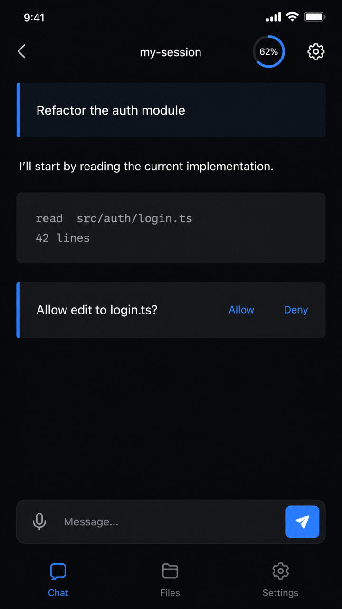
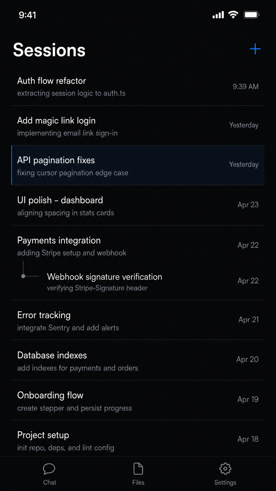
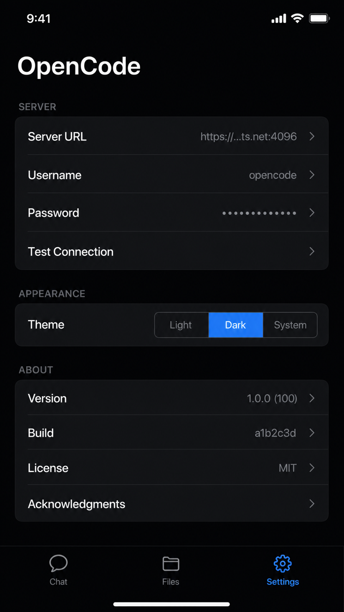
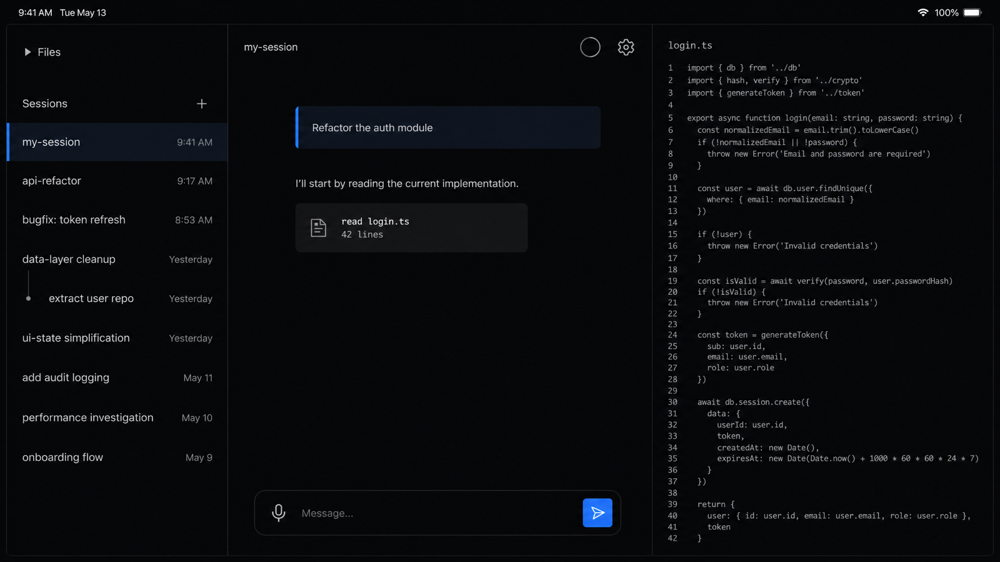

# OpenCode iOS Client 设计 Spec — 冷静科技感（Quiet Tech）

本文件是 OpenCode iOS Client 视觉重做的实施 spec，不是评审记录。它取代了之前那份"诊断 + 多方向建议"的草稿（诊断结论仍然成立，附在文末"诊断回顾"里），专注一件事：把视觉方向锁定为一套叫 **Quiet Tech** 的设计语言，并拆成可以直接照着改 SwiftUI 代码的规格。

方向的一句话定义：像 Raycast、Vercel、Arc 那一类现代开发者工具——深色为主、低饱和、靠精准的间距和细描边而不是装饰来显贵。它不喧哗，所有"贵"都来自克制、一致和恰到好处的留白节奏。

这份 spec 和姊妹项目 VoiceFlow 的 `docs/design.md`（暖琥珀/深墨）是同一套方法论的两个实例：单一识别色、颜色不建立层级、无边框优先、极轻动效。两个 app 因此有家族感，但 OpenCode 更偏冷、更偏工具。

## 设计原则

1. **深色是主场，浅色是平替。** OpenCode 的用户是开发者，深色模式是默认审美。深色模式优先调到完美，浅色模式跟随同一套 token 做映射，而不是反过来。
2. **单一识别色：电蓝 `#3B82F6`。** 整个 app 只有一个色相承担"可交互/品牌"语义——发送、选中、链接、活跃。金色 `#D9A621` 仅作为**唯一的次级强调**，只用在"AI 正在工作"这一种瞬时状态上，平时不出现。除这两色外，全部走中性灰阶。系统的 `.red/.green/.orange/.purple` 一律不直接用。
3. **语义靠形态和位置，不靠颜色堆叠。** 现状最大的问题是"一屏五种颜色同一个形状"（tool/patch/permission 卡片都是圆角矩形+浅底+描边，只换颜色）。新方案用**卡片形态**区分功能类别，颜色只在极少数地方点缀。
4. **颜色不建立层级，字号和留白建立层级。** 同一种文字色下用字号、字重、间距区分主次。次级灰只给真正次级的信息（时间戳、路径、placeholder）。
5. **无边框优先。** 信息类容器去描边、只留极淡底色或纯靠留白分组；只有需要"请你操作"的卡片才用一条左侧色条作为功能信号。描边在 iOS 里暗示表单字段，chat 流里要少用。
6. **极轻、极快的动效。** 状态切换走 spring（response 0.3–0.35, damping 0.8）或 250–300ms ease-out，opacity crossfade 优先于位移。动效是这套设计里"廉价的奢华"，但绝不 bouncing、不做炫技 splash。
7. **小屏保功能，大屏给留白。** 见下文"两套布局策略"。同一套 token、同一个品牌，但 iPhone 单栏紧凑、iPad/visionOS 三栏舒展，是两种不同的"贵"。

## 双模色板

两套模式共用一组语义 token，只换底色/文字映射。实现上 `DesignTokens` 用 `Color(light:dark:)` 双值定义，View 层只引用语义名，不写 ad-hoc `.opacity()` 或系统灰。

### 深色模式（主场）

| Token | Hex | 用途 |
|---|---|---|
| `bg.primary` | `#0B0C0E` | 主背景，近黑带极轻微冷偏移 |
| `bg.secondary` | `#141619` | 次级背景：sidebar、sheet、settings 分组 |
| `surface` | `#1A1D21` | 信息卡片底（tool/patch 输出区） |
| `text.primary` | `#ECEDEE` | 主文字、AI 回复正文 |
| `text.secondary` | `#9BA1A6` | 次级：时间戳、状态、tool 名 |
| `text.tertiary` | `#5A6066` | placeholder、disabled、代码路径 |
| `divider` | `#23272B` | 极细分隔线（1px，sidebar/settings 行间） |
| `accent` | `#3B82F6` | 唯一识别色：发送、选中、链接、用户消息色条 |
| `accent.muted` | `#3B82F614` | accent 8% alpha，用户消息底/选中行底 |
| `gold` | `#D9A621` | 唯一次级强调：仅"AI 工作中"瞬时态 |

### 浅色模式（平替）

| Token | Hex | 用途 |
|---|---|---|
| `bg.primary` | `#FBFBFC` | 主背景，近白带极轻微冷偏移 |
| `bg.secondary` | `#F4F5F6` | 次级背景 |
| `surface` | `#F0F1F3` | 信息卡片底 |
| `text.primary` | `#1A1D21` | 主文字（深墨，非纯黑） |
| `text.secondary` | `#6B7177` | 次级文字 |
| `text.tertiary` | `#9BA1A6` | placeholder、disabled |
| `divider` | `#E6E8EA` | 极细分隔线 |
| `accent` | `#2563EB` | 同色相，浅底上略深一档保证对比 |
| `accent.muted` | `#2563EB14` | accent 8% alpha |
| `gold` | `#B8860B` | 浅底上略深的金 |

### 状态颜色语义（取代"红绿橙圆点"）

现状用红/绿/橙表达 error/success/warning，违反单一识别色。新方案让颜色退场，用形态和文字承担：

| 状态 | 表达方式 |
|---|---|
| AI 空闲 / 就绪 | 无任何色彩，纯文字 |
| AI 工作中 | 唯一允许 `gold` 出现的地方：composer 旁的脉冲点 + context ring 高占用时的脉冲 |
| 成功 / 完成 | 用 `text.secondary` 的 checkmark + 文字，不用绿 |
| 错误 | `accent`（蓝）承担警示 + 明确文字，不用红色块（红只保留给真正破坏性操作如删除 session 的确认按钮） |
| 警告 | `gold` 文字 + 说明，不用橙底块 |

整屏在任何时刻最多出现一处彩色（accent 或 gold），其余全灰阶。这是"冷静"的硬约束。

## 字体

系统 SF，显式选 design 变体。不引第三方字体（中文回退链、包体积、和系统 UI 融合都更好）。

- **Display** — Session 标题、空状态主文案：SF Pro Display Semibold 22pt，`text.primary`。出现极少。
- **Body** — AI 回复正文（用户 90% 时间在看）：SF Pro Text Regular 16pt，行距 1.45，`text.primary`。
- **Body Prominent** — 用户消息：SF Pro Text Medium 16pt。用字重而非颜色和 AI 回复区分。
- **Meta** — 时间戳、状态、tool 名、agent/model 标签：SF Pro Text Regular 13pt，`text.secondary`。
- **Micro Mono** — 代码、文件路径、tool 输入输出：SF Mono Regular 12pt，`text.tertiary`。只在展开详情时出现。

字号差是层级的主要载体：22 / 16 / 13 / 12 四档，跨度明确，不在中间塞更多档。

## 卡片设计语言

按功能分三类形态，这是解决"彩虹色表格"的核心：

1. **信息卡片**（tool 输入输出、patch、diff）：**无描边**，只 `surface` 底色。靠内部排版（mono 字体 + 留白）建立结构。展开详情区内边距 14pt。一屏内多张信息卡片视觉上是"同一种安静的容器"，不抢戏。
   - **可点暗示**：tool/patch 卡片虽然容器是中性 `surface`，但它们**是可交互的**（点开看 input/output、跳文件预览）。所以卡片**内部**的可操作元素——工具图标、工具名、可跳转的文件路径、展开 chevron——用 `accent` 电蓝着色，作为"这能点"的信号；卡身保持中性。把整张卡都灰掉会让它读起来像禁用控件（实测踩过这个坑）。accent 点在可交互的局部，不是铺满整卡，所以既给了 affordance 又不退回"彩虹色卡片"。纯展示、不可点的文字（如 tool reason 描述）仍走 `text.secondary` 灰。
2. **操作卡片**（permission、question——需要用户响应）：无外框，但左侧一条 3pt `accent` 色条 + `surface` 底。色条是"请你操作"的功能信号，在 iOS 里少见所以有新鲜感。这是全屏少数允许出现 accent 的地方之一。
3. **状态行**（turn activity、"2:30 elapsed"）：**不是卡片**。去掉底色和圆角，就是一行 `text.secondary` 的 meta 文字 + 可选 mono 计时。

圆角统一：信息/操作卡片 12pt，sheet 16pt，inline tag 6pt。不混用。

## 消息区

- 用户消息：**全宽 + 左侧 3pt `accent` 色条 + `accent.muted` 底**，Body Prominent 字重。和操作卡片同构（左色条语言贯穿全 app）。右对齐气泡不用——iPad 宽屏下浪费空间，且色条方案更现代。
- AI 回复：**完全无容器**，纯 `text.primary` 正文铺在 `bg.primary` 上，靠上下 20pt 间距和用户消息区分。流式文本逐字出现，不加入场动画。
- 消息间距 20pt（现状 12pt 太挤）。每条消息是一个完整思考单元，要呼吸感。

## Composer

- 输入框：去描边，只 `bg.secondary` 底，16pt 圆角。描边暗示表单字段，自由文本区不要。
- 发送：独立的圆角矩形按钮（非圆形 icon），`accent` 实底白图标，贴输入框右侧底部对齐——视觉上属于"输入区域的一部分"。
- mic：移到输入框**内部左侧**，作为框内功能图标（`text.secondary`）。
- AI 执行时：send 按钮**原位**替换为 stop（同位置同尺寸，图标变 stop，色变中性而非红——红留给破坏性操作），旁边出现唯一的 `gold` 脉冲点表示"工作中"。

## 动效（投入产出比最高）

- 用户消息出现：offset y 16→0 + opacity 0→1，ease-out 0.28s。AI 流式文本不加。
- Tool 卡片展开：自定义 spring（response 0.32, damping 0.82），比系统 DisclosureGroup 快一点弹一点。
- Permission/Question 卡片出现：从下滑入 offset y 24→0 + 淡入，比纯淡入更能吸引"请看我"。
- Session 切换：消息列表 opacity crossfade 0.2s，避免瞬切的"卡一下"感。
- 不做：splash 动画、bouncing、渐变背景（2024 后渐变是廉价信号）。

## 两套布局策略（小屏 vs 大屏）

品牌、token、色彩、字体、卡片语言**完全一致**；布局和留白策略不同。这是这次设计最关键的补充——iPhone 上堆留白会牺牲功能，iPad/visionOS 上不给留白则浪费屏幕。

### 小屏（iPhone，单栏，功能优先）

- 单栏：底部 Tab（Chat / Files / Settings）。Session 列表从 Chat 顶部的入口推入（或下拉），不常驻。
- 留白克制：消息间距 20pt，卡片内边距 14pt，屏幕水平边距 16pt。够呼吸但不浪费纵向空间。
- Toolbar 精简到 4 个：session 入口、配置（model+agent 合并进一个 sheet）、context ring（18pt）、settings。rename 降级到 session 列表的 swipe action。
- Composer 紧凑：单行起，最多长到 ~100pt 高。

```
 iPhone — Chat（深色）
 ┌──────────────────────────────┐
 │ ‹  my-session      ◌  ⚙       │  ← 精简 toolbar，◌=context ring
 ├──────────────────────────────┤
 │ ▎Refactor the auth module     │  ← 用户消息：左 accent 色条 + muted 底
 │                               │
 │ I'll start by reading the     │  ← AI 回复：无容器，纯正文
 │ current implementation.       │
 │                               │
 │ ┌ read  src/auth/login.ts ──┐ │  ← 信息卡片：无描边，surface 底
 │ │ 42 lines                  │ │
 │ └───────────────────────────┘ │
 │ ▎ Allow edit to login.ts?     │  ← 操作卡片：左 accent 色条
 │   Allow      Deny             │
 ├──────────────────────────────┤
 │ 🎤 Message…              [ ▷ ]│  ← mic 在框内左，send 实底贴右
 ├──────────────────────────────┤
 │  Chat      Files     Settings │
 └──────────────────────────────┘
```

### 大屏（iPad / visionOS，三栏，留白舒展）

现状是 `NavigationSplitView` 三栏（左 sidebar 上=file tree 下=Session 列表 / 中 文件预览 / 右 Chat）。这次的调整属于**改进**：

- **三栏角色**：左 = Session 列表（树形，父子缩进 + leaf 圆点 + 选中态；行只有标题/时间/状态，**没有摘要预览**——别再画那个）；中 = Chat（主场）；右 = 文件预览（从 Chat 点 tool/patch 跳来的单文件预览，可折叠）。
- **file tree 默认收起**（用户决策）：iPad 上文件树不再常驻占空间，降级为左栏顶部一个默认收起、可展开的 "Files" disclosure。它在 iPhone 上仍是独立 tab。把横向空间让给 Chat 和预览。
- 大留白：屏幕水平边距 32pt，消息间距 28pt，卡片内边距 18pt。留白本身是"贵"的来源。
- 内容列限宽：Chat 正文最大宽度约 720pt 居中，不铺满整个中栏——长行不利阅读，限宽是 editorial 的高级感。
- 右栏文件预览：**代码纯文本 + 行号等宽渲染，无语法高亮**（现状如此，见下文 future 说明），不画彩色 token；Markdown 走预览，图片可缩放。
- visionOS：沿用现有 `DesignControls` 的大尺寸 composer 分支（48/56pt 按钮，gaze 友好），材质用系统 glass，色彩 token 不变。

```
 iPad — 三栏（深色）
 ┌───────────────┬───────────────────────────┬──────────────┐
 │ ▸ Files       │  my-session        ◌  ⚙    │  login.ts    │
 │ Sessions   +  │                             │  ──────────  │
 │ ───────────── │   ▎Refactor the auth module │  1  import…  │
 │ ▎my-session   │                             │  2  export…  │
 │  └ sub-task   │   I'll start by reading the │  3  …        │
 │ chat-2        │   current implementation.   │              │
 │               │   ┌ read login.ts ────────┐ │  纯文本+行号 │
 │               │   │ 42 lines              │ │  无语法高亮  │
 │               │   └───────────────────────┘ │              │
 │               │   🎤 Message…         [ ▷ ] │              │
 └───────────────┴───────────────────────────┴──────────────┘
   ↑ ▸Files 默认收起        ↑ 正文限宽 720pt 居中    ↑ 单文件预览
   Session 树（无摘要预览）
```

## 空状态与引导

- 空 session 列表：深色版 logo（需补，现仅 `logo_light.png`）+ 一句有性格的文案，如 "Start a conversation with your code"，不用 "No sessions"。logo 下极微妙呼吸动画（scale 1.0→1.02→1.0，3s）。
- 空 chat：居中简短引导文字，无图标。

## 不做清单

- 不加渐变背景。纯色 + 留白 + 动效比渐变高级。
- 不引第三方字体。SF Pro/SF Mono 够用且融合系统。
- 不做 splash 动画。
- 不重新设计信息架构（Tab + 三栏是对的）。
- 不让第二种彩色常驻——gold 只在"工作中"，其余时刻全灰 + 至多一处 accent。

## 功能边界（这是实施稿，严格区分三类）

这份 spec 要落地实现，所以每个视觉元素必须对得上真实功能。三类：

**现状已有，本设计只改视觉、不改功能**：3 tab（Chat/Files/Settings）；iPhone Session 列表是 sheet；iPad 三栏；Chat 的 10 种消息渲染（用户消息、AI 文本、tool 卡、patch 卡、permission 卡、question 卡、todo、turn activity、streaming reasoning，step 不渲染）；markdown + 图片预览（可缩放）；file tree（展开折叠 + git 状态色）；composer（mic/send/stop + VoiceFlowKit 语音）；toolbar（session/rename/create/model-agent picker/context ring/settings）；Settings（Server/Project/SSH Tunnel/AI Builder/Appearance/About）；Session 树形嵌套 + swipe 删除；双模主题。

**本设计的视觉改进（改的是观感，不新增功能）**：单一识别色收敛（permission 的绿/蓝/红、patch 的橙、tool 的蓝 → 统一电蓝 + gold 仅"工作中"）；卡片三态形态语言取代"多色同形"；用户消息左色条；composer 的 mic 移入框内、send 做成实底；iPad file tree 默认收起。这些都不依赖新后端能力，是纯前端视觉/布局调整。

**明确不在本设计内（future / 不画进 mockup）**：
- **代码语法高亮**：现状是纯文本 + 行号单色渲染（`Text(line)`），**没有**语法高亮。mockup 一律画纯文本。语法高亮列为 future enhancement——有技术成本（需要 tokenizer / highlight 库，且要兼顾性能和大文件），本轮不做、也不在图里假装有。
- Session 行摘要预览、diff 侧边对比、消息搜索/编辑、文件上传等 audit 中"未 shipped"的项，一律不设计。

## 实现落点

`OpenCodeClient/OpenCodeClient/Utils/DesignTokens.swift` 已有 Brand/Semantic/Neutral/Opacity/Typography/Spacing/Controls/Corners 雏形。这次是**提纯**：把上表的 hex 和语义灌进去、删掉 ad-hoc 系统灰与多余 Semantic 色、把 Typography 收敛到 22/16/13/12 四档、间距按小屏/大屏两套节奏。View 层禁止再出现 `Color.blue/.red/.gray.opacity(…)`。

## 效果图

`docs/design_images/` 下的 mockup 由 GPT image generation（gpt-image-2）生成，用来锁定"冷静科技感"的视觉目标，不是像素级实现稿。

### 小屏（iPhone，单栏）

Chat 是用户 90% 时间所在。注意：用户消息的蓝色左色条、AI 回复无容器、信息卡片无描边只留深色底、操作卡片的左色条 + 文字按钮、composer 的 mic 在框内左 / 实底蓝 send 贴右、以及全屏至多一处蓝色 accent。



Session 列表：每行标题 + 灰色摘要预览 + 时间，选中行用极淡蓝底 + 蓝左条，子 session 用竖线 + 圆点连接器表达父子。



Settings：分组列表，Theme 分段控件是少数允许出现 accent 的地方，其余全灰阶。



### 大屏（iPad / visionOS，三栏）

同一套 token 与品牌，布局舒展：左 Session 列表、中 Chat（正文限宽居中，editorial 留白）、右文件/代码预览。代码预览的语法高亮要收敛到冷静灰阶为主，避免彩虹色。



## 诊断回顾（来自上一版，结论仍成立）

当前 UI 是工程师驱动设计：信息层级扁平（全同字号同间距）、留白不足（消息 12pt、卡片 8pt 太挤）、缺品牌性格（纯系统 SF Symbols + 系统色，像 SwiftUI 教程项目）、微交互缺失（无过渡动画）。本 spec 的每条原则都对应解掉其中一类问题。
