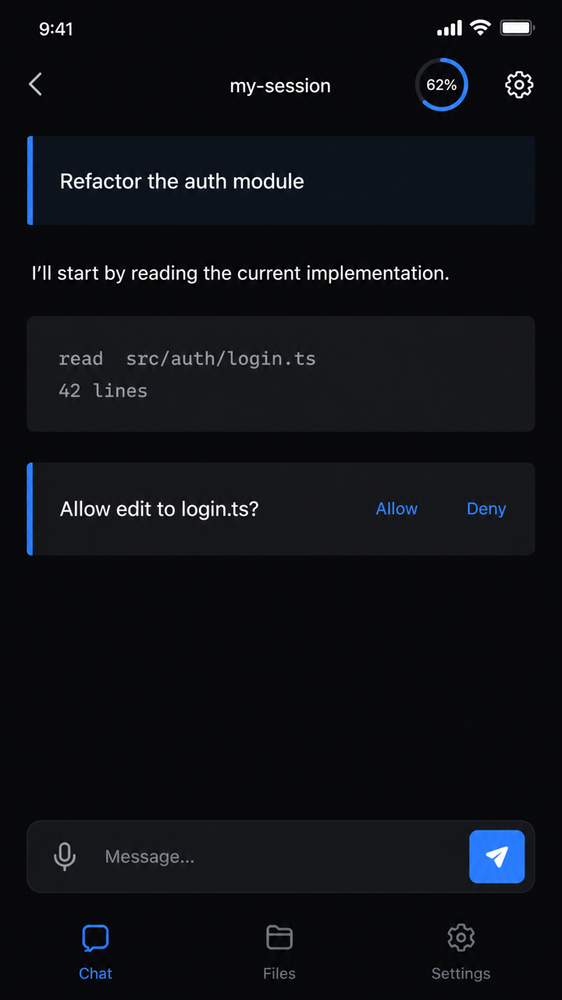
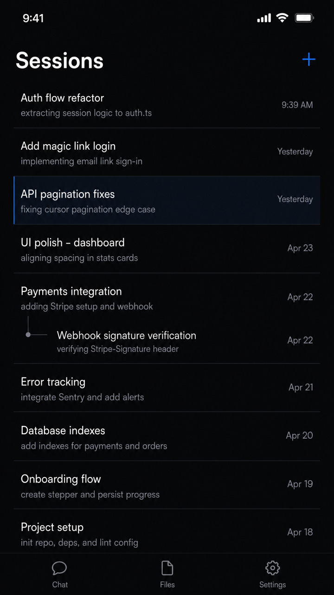
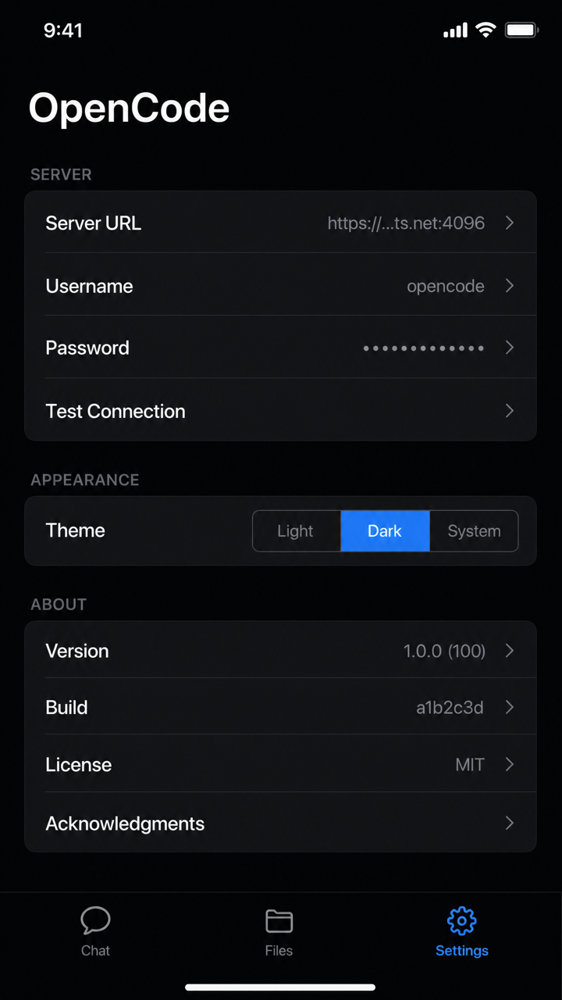
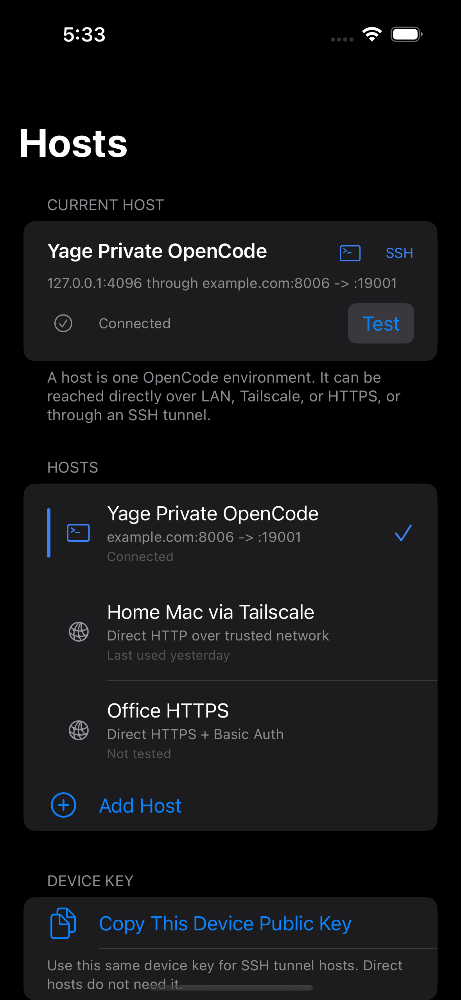
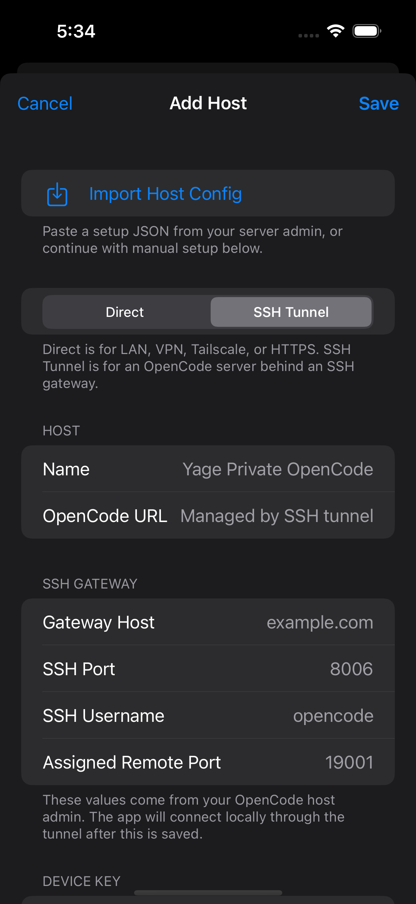
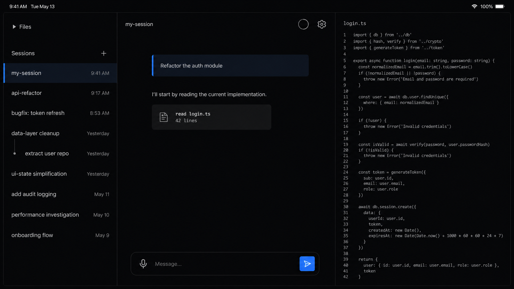
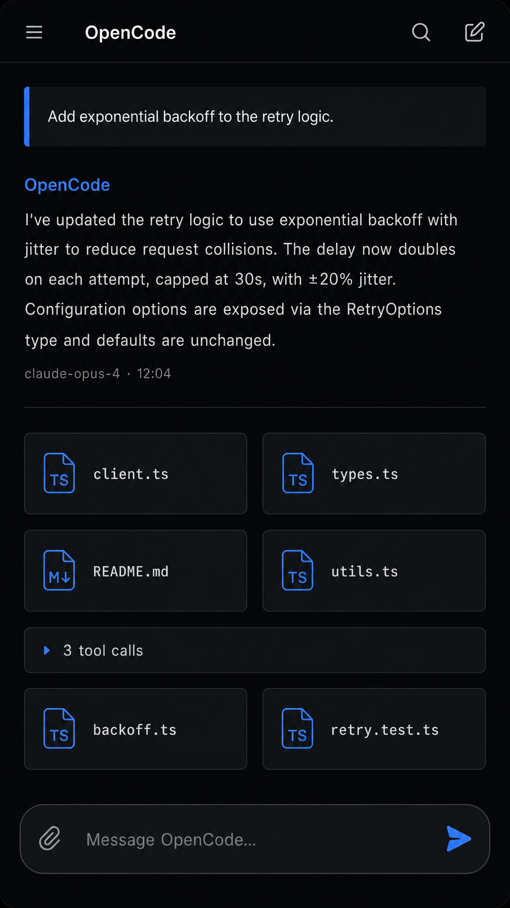

# OpenCode iOS Client 设计 Spec — 冷静科技感（Quiet Tech）

本文件是 OpenCode iOS Client 视觉重做的实施 spec，而非评审记录。本文取代了先前的"诊断 + 多方向建议"草稿（诊断结论依然有效，附于文末"诊断回顾"中），核心目标在于：将视觉方向明确收敛为名为 **Quiet Tech** 的设计语言，并拆解为可直接指导 SwiftUI 代码实现的具体规范。

设计方向定义：看齐 Raycast、Vercel 与 Arc 这类现代开发者工具——以深色为主调、低饱和度，依托精准的间距与细微描边而非繁复装饰来呈现高级质感。整体风格保持克制内敛，质感来自规范的一致性与恰到好处的留白节奏。

本 spec 与姊妹项目 VoiceFlow 的 `docs/design.md`（暖琥珀/深墨）遵循同一套设计方法论：单一识别色、颜色不承担层级划分、无边框优先、极轻动效。两款应用共享家族式设计语言，而 OpenCode 在基调上更偏冷峻、更强调工具属性。

## 设计原则

1. **深色是主场，浅色是平替。** OpenCode 的目标用户是开发者，深色模式是默认的审美基调。设计上优先将深色模式打磨完善，浅色模式则基于同一套 token 完成映射，而非本末倒置。
2. **单一识别色：电蓝 `#3B82F6`。** 全应用仅使用单一色相承载"可交互/品牌"语义——涵盖发送、选中、链接与活跃状态。金色 `#D9A621` 仅作为**唯一的次级强调**，严格限制在"AI 正在工作"这一瞬时状态下使用，常规状态不出现。除这两种颜色外，其余元素均采用中性灰阶，严禁直接使用系统自带的 `.red/.green/.orange/.purple`。
3. **语义靠形态和位置，不靠颜色堆叠。** 现状的核心痛点在于"同屏内多种颜色套用同一形状"（tool、patch 与 permission 卡片均为圆角矩形配合浅底与描边，仅靠色彩区分）。新方案通过**卡片形态**区分功能类别，颜色仅在极少数关键位置作为点缀。
4. **颜色不建立层级，字号和留白建立层级。** 在统一的文字色彩下，依靠字号、字重与间距来明确主次关系。次级灰阶仅用于真正的次级信息（如时间戳、文件路径与 placeholder）。
5. **无边框优先。** 信息展示类容器移除描边，仅保留极浅底色或纯粹依靠留白进行视觉分组；仅在需要用户交互响应的卡片上，才在左侧使用一条强调色条作为操作引导。描边在 iOS 中通常暗示表单输入域，应避免在 chat 消息流中泛滥。
6. **极轻、极快的动效。** 状态过渡采用 spring（response 0.3–0.35, damping 0.8）或 250–300ms ease-out，优先使用 opacity crossfade 而非大幅度位移。动效作为提升质感的轻量手段，坚决杜绝 bouncing 弹跳与炫技式的 splash 动画。
7. **小屏保功能，大屏给留白。** 详见后文"两套布局策略"。在同一套 token 与品牌语言下，iPhone 采用单栏紧凑排布以确保操作效率，iPad 与 visionOS 则采用三栏舒展布局，展现不同尺寸下的空间质感。
8. **稳定按钮不换位。** 用户对于 composer 中的发送与麦克风按钮具有强烈的肌肉记忆。发送与麦克风按钮必须始终固定在各自纵向排列的底部槽位；stop 或 retry 等临时操作按钮只允许出现在其上方，绝不能挤占或位移常驻主按钮。

## 双模色板

两套模式共享同一套语义 token 定义，仅切换底色与文字的映射关系。代码实现上，`DesignTokens` 通过 `Color(light:dark:)` 进行双值封装，View 层统一引用语义命名，避免编写 ad-hoc 的 `.opacity()` 或直接调用系统灰色。

### 深色模式（主场）

| Token | Hex | 用途 |
|---|---|---|
| `bg.primary` | `#0B0C0E` | 主背景，近黑且带有极轻微冷调偏移 |
| `bg.secondary` | `#141619` | 次级背景：sidebar、sheet 与 settings 分组 |
| `surface` | `#1A1D21` | 信息卡片背景（tool/patch 输出区域） |
| `text.primary` | `#ECEDEE` | 主文字、AI 回复正文 |
| `text.secondary` | `#9BA1A6` | 次级信息：时间戳、状态、tool 名称 |
| `text.tertiary` | `#5A6066` | placeholder、disabled 态、代码路径 |
| `divider` | `#23272B` | 极细分隔线（1px，用于 sidebar/settings 行间） |
| `accent` | `#3B82F6` | 唯一品牌识别色：发送、选中态、链接、用户消息指示条 |
| `accent.muted` | `#3B82F614` | accent 8% alpha，用户消息背景与选中行背景 |
| `gold` | `#D9A621` | 唯一次级强调：仅用于"AI 工作中"瞬时态 |

### 浅色模式（平替）

| Token | Hex | 用途 |
|---|---|---|
| `bg.primary` | `#FBFBFC` | 主背景，近白且带有极轻微冷调偏移 |
| `bg.secondary` | `#F4F5F6` | 次级背景 |
| `surface` | `#F0F1F3` | 信息卡片背景 |
| `text.primary` | `#1A1D21` | 主文字（深墨色，非纯黑） |
| `text.secondary` | `#6B7177` | 次级文字 |
| `text.tertiary` | `#9BA1A6` | placeholder、disabled 态 |
| `divider` | `#E6E8EA` | 极细分隔线 |
| `accent` | `#2563EB` | 保持同色相，浅色底上调深一档以确保对比度 |
| `accent.muted` | `#2563EB14` | accent 8% alpha |
| `gold` | `#B8860B` | 浅色底上适配的加深金色 |

### 状态颜色语义（取代"红绿橙圆点"）

现状采用红/绿/橙表达 error/success/warning，违背了单一识别色原则。新方案弱化色彩参与，转由形态结构与文本明确表达：

| 状态 | 表达方式 |
|---|---|
| AI 空闲 / 就绪 | 无彩色修饰，纯文字呈现 |
| AI 工作中 | 唯一允许出现 `gold` 的场景：composer 旁的脉冲指示点 + context ring 高占用时的脉冲动效 |
| 成功 / 完成 | 采用 `text.secondary` 样式的 checkmark 搭配文字说明，不使用绿色 |
| 错误 | 采用 `accent`（蓝）承载警示并配合明确文本，不使用红色背景块（红色仅保留给删除 session 确认按钮等破坏性操作） |
| 警告 | 采用 `gold` 文字配合说明，不使用橙色背景块 |

在任何时刻，整个屏幕最多仅允许出现一处彩色（accent 或 gold），其余区域均保持灰阶呈现。这是贯彻"冷静"风格的硬性约束。

## 字体

统一采用系统 SF 字体并显式指定 design 变体。不引入第三方字体，以确保更优的中文回退表现、更小的安装包体积以及与系统 UI 的无缝融合。

- **Display** — Session 标题与空状态主文案：SF Pro Display Semibold 22pt，`text.primary`。仅在极少数场景出现。
- **Body** — AI 回复正文（承载用户 90% 的阅读时长）：SF Pro Text Regular 16pt，行距 1.45，`text.primary`。
- **Body Prominent** — 用户消息：SF Pro Text Medium 16pt。通过字重差异而非颜色来区分 AI 回复。
- **Meta** — 时间戳、状态信息、tool 名称及 agent/model 标签：SF Pro Text Regular 13pt，`text.secondary`。
- **Micro Mono** — 代码片段、文件路径与 tool 输入输出：SF Mono Regular 12pt，`text.tertiary`。仅在展开详情区域展示。

字号阶梯是视觉层级的主要载体：严格收敛为 22 / 16 / 13 / 12 四档跨度明确的规格，避免引入中间过渡字号。

## 卡片设计语言

按功能划分为三类形态，这是解决原先色彩杂乱问题的核心：

1. **信息卡片**（tool 输入输出、patch、diff）：**无描边**，仅使用 `surface` 底色。依靠内部排版（等宽 mono 字体配合留白）建立信息层次。展开详情区域内边距为 14pt。同屏内的多张信息卡片在视觉上保持统一、内敛的容器质感，不喧宾夺主。
   - **可点暗示**：tool/patch 卡片虽然整体采用中性 `surface` 底色，但本身**具备交互属性**（支持点击查看 input/output 或跳转文件预览）。因此，卡片**内部**的关键可操作元素——工具图标、工具名、可跳转的文件路径与展开 chevron——均采用 `accent` 电蓝色高亮，以此传递明确的可点击提示；卡片本体则维持中性底色。若将整张卡片完全置灰，容易让用户误判为禁用控件（实际迭代中已验证此问题）。将 accent 聚焦在局部交互热区而非铺满整卡，既提供了充足的操作暗示（affordance），又避免倒退回杂乱的彩色卡片风格。对于纯展示、不可交互的文本（如 tool reason 描述），依然维持 `text.secondary` 灰色。
2. **操作卡片**（permission、question 等需用户响应的组件）：采用无外边框设计，左侧配置一条 3pt 的 `accent` 色条并搭配 `surface` 底色。该色条作为提示用户进行操作的功能信号，在 iOS 界面中具有清晰辨识度。这也是全屏少数允许使用 accent 的关键区域之一。
3. **状态行**（turn activity、"2:30 elapsed" 等）：**不以卡片形态呈现**。去除底色与圆角容器，直接渲染为单行 `text.secondary` 的 meta 文本，并支持可选的 mono 等宽计时展示。

圆角规格全局统一：信息/操作卡片为 12pt，sheet 为 16pt，inline tag 为 6pt，严格规范、禁止混用。

## 消息区

- 用户消息：采用**全宽 + 左侧 3pt `accent` 色条 + `accent.muted` 底色**，配合 Body Prominent 字重。该形态与操作卡片保持同构（左侧色条作为全局贯穿的设计语言）。放弃右对齐气泡形态——气泡在 iPad 宽屏下空间利用率较低，而色条方案视觉更为现代利落。
- AI 回复：**完全不使用容器包裹**，纯 `text.primary` 正文直接排布在 `bg.primary` 背景上，仅通过上下 20pt 间距与用户消息形成区隔。流式文本逐字平滑渲染，不添加多余的入场动画。
- 消息间距设定为 20pt（原 12pt 过于拥挤）。将每条消息视为独立的思考单元，通过充足留白提供呼吸感。

## Composer

- 输入框：移除描边，仅采用 `bg.secondary` 底色配合 16pt 圆角。描边常带有表单字段暗示，自由文本输入区应保持无框感。
- text review field：在语音转写或 retry 过程中，持续追加或替换的 partial transcript 需驱动文本框自动滚动至末尾，呈现打字机般的最新文本输出；在手动编辑与草稿恢复场景下则维持系统默认滚动逻辑，避免干扰用户光标。
- 发送：采用独立的圆角矩形按钮（非圆形图标），以 `accent` 实底搭配白色图标，紧贴输入框右侧底部对齐，在视觉上作为"输入区域的有机组成部分"。
- mic：调整至输入框**内部左侧**，作为框内功能图标呈现（`text.secondary`）。
- AI 执行时：send 按钮**始终保留**（符合产品既定逻辑——任务运行期间仍可直接追加新消息，无需手动终止前序任务），且固定位于右侧纵向排列的**底部槽位**。stop 作为**额外增设**的操作按钮展示在 send **上方**（同等尺寸的实底圆角方块，采用 VStack 纵向排列，stop 居上、send 居下），AI 任务结束后自动隐去。需明确 stop 并不替换 send，二者为并存堆叠关系。色彩规范上，send 采用 `accent` 蓝，stop 采用红色（承载中断/破坏性操作语义）。
- 语音输入：mic 始终固定在左侧纵向排列的**底部槽位**。录音期间仅显示红色 mic，点击即可正常结束录音并进入转写；转写期间 mic 呈现加载状态，右侧同步显示用于强制中断的 `Stop transcription wait`；显式中断后，左侧底部槽位切换为 retry 图标按钮，右侧显示 `Discard audio`。retry 为唯一的主恢复操作，discard 则为退出恢复态的轻量操作，两者职责明确，不可重复定义为两个重试入口。所有临时语音状态均不得改变 send 按钮的固定位置。

## 动效（投入产出比最高）

- 用户消息登场：采用 offset y 从 16→0 配合 opacity 从 0→1 的过渡，时长 ease-out 0.28s。AI 流式文本不添加任何入场动效。
- Tool 卡片展开：采用自定义 spring（response 0.32, damping 0.82），带来比系统默认 DisclosureGroup 更为紧凑灵动的展开体验。
- Permission/Question 卡片登场：从下方滑入（offset y 从 24→0）并配合淡入效果，相比纯淡入能更有效地引导用户视觉焦点。
- Session 切换：消息列表采用 0.2s 的 opacity crossfade 渐变过渡，消除直接硬切带来的突兀停顿感。
- 明确不做：splash 启动动画、bouncing 弹跳动效、渐变背景（避免过度装饰带来的视觉廉价感）。

## 两套布局策略（小屏 vs 大屏）

在保持品牌、token、色彩、字体及卡片设计语言**完全一致**的前提下，依据设备形态制定差异化的布局与留白策略。这是本次设计规范的核心补全：避免在 iPhone 上因过度留白而压缩操作空间，同时确保在 iPad 与 visionOS 等大屏设备上通过充裕留白释放屏幕优势。

### 小屏（iPhone，单栏，功能优先）

- 单栏架构：采用底部 Tab 导航（Chat / Files / Settings）。Session 列表通过 Chat 顶部入口触发推入（或下拉展示），不常驻占据屏幕。
- 克制留白：消息间距设为 20pt，卡片内边距为 14pt，屏幕水平边距为 16pt。在保障呼吸感的同时充分利用纵向显示空间。
- Toolbar 控件精简为 4 项：session 入口、配置项（model 与 agent 整合至统一 sheet）、context ring（18pt）与 settings。重命名（rename）操作降级为 session 列表中的 swipe action。
- 紧凑型 Composer：默认单行高度，自适应撑开上限约为 ~100pt。

```
 iPhone — Chat（深色）
 ┌──────────────────────────────┐
 │ ‹  my-session      ◌  ⚙       │  ← 精简 toolbar，◌=context ring
 ├──────────────────────────────┤
 │ ▎Refactor the auth module     │  ← 用户消息：左 accent 色条 + muted 底
 │                               │
 │ I'll start by reading the     │  ← AI 回复：无容器，纯正文
 │ current implementation.       │
 │                               │
 │ ┌ read  src/auth/login.ts ──┐ │  ← 信息卡片：无描边，surface 底
 │ │ 42 lines                  │ │
 │ └───────────────────────────┘ │
 │ ▎ Allow edit to login.ts?     │  ← 操作卡片：左 accent 色条
 │   Allow      Deny             │
 ├──────────────────────────────┤
 │ 🎤 Message…              [ ▷ ]│  ← mic 在框内左，send 实底贴右
 │ ├──────────────────────────────┤
 │  Chat      Files     Settings │
 └──────────────────────────────┘
```

### 大屏（iPad / visionOS，三栏，留白舒展）

原设计采用 `NavigationSplitView` 三栏架构（左侧 sidebar 上方为 file tree、下方为 Session 列表 / 中间为文件预览 / 右侧为 Chat）。本次调整在此基础上进行**针对性优化**：

- **三栏角色分工**：左栏 = Session 列表（树状结构，支持父子层级缩进、leaf 圆点标记及选中态；列表行仅展示标题、时间与状态，**不包含摘要预览**）；中栏 = Chat 交互核心区（主场）；右栏 = 文件预览区（用于承载从 Chat 中点击 tool/patch 触发的单文件预览，支持折叠收起）。
- **file tree 默认收起**（明确的产品决策）：iPad 上文件树不再常驻占用屏幕宽度，降级为左栏顶部默认折叠、支持手动展开的 "Files" disclosure。该功能在 iPhone 上仍作为独立 tab 保留，从而将宝贵的横向空间释放给 Chat 与预览视图。
- 舒展留白：屏幕水平边距设定为 32pt，消息间距为 28pt，卡片内边距为 18pt。通过充裕的留白营造精致的质感。
- 内容区域限宽：Chat 正文内容居中排布且最大宽度限制在约 720pt，不铺满整个中栏——过长的文本行不利于阅读体验，限宽设计能呈现更具编辑质感的版式风格。
- 右栏文件预览：**采用纯文本代码配合行号等宽渲染，不包含语法高亮**（维持现状逻辑，详见后文 future 说明），不绘制彩色 token；Markdown 提供格式化预览，图片支持手势缩放。
- visionOS 适配：复用现有 `DesignControls` 中的大尺寸 composer 分支（48/56pt 按钮以提供良好的 gaze 注视交互体验），材质采用系统级 glass 质感，色彩 token 保持完全一致。

```
 iPad — 三栏（深色）
 ┌───────────────┬───────────────────────────┬──────────────┐
 │ ▸ Files       │  my-session        ◌  ⚙    │  login.ts    │
 │ Sessions   +  │                             │  ──────────  │
 │ ───────────── │   ▎Refactor the auth module │  1  import…  │
 │ ▎my-session   │                             │  2  export…  │
 │  └ sub-task   │   I'll start by reading the │  3  …        │
 │ chat-2        │   current implementation.   │              │
 │               │   ┌ read login.ts ────────┐ │  纯文本+行号 │
 │               │   │ 42 lines              │ │  无语法高亮  │
 │               │   └───────────────────────┘ │              │
 │               │   🎤 Message…         [ ▷ ] │              │
 └───────────────┴───────────────────────────┴──────────────┘
   ↑ ▸Files 默认收起        ↑ 正文限宽 720pt 居中    ↑ 单文件预览
   Session 树（无摘要预览）
```

## 空状态与引导

- 空 session 列表：展示深色版本 logo（待补充资产，目前仅有 `logo_light.png`）配合具有品牌性格的文案，例如 "Start a conversation with your code"，避免使用生硬的 "No sessions"。logo 配合极为轻微的呼吸动效（scale 1.0→1.02→1.0，周期 3s）。
- 空 chat 界面：居中呈现简明引导文本，不配置图标。

## 不做清单

- 不引入渐变背景：采用纯色底色配合考究的留白与微动效，呈现更高级的视觉质感。
- 不引入第三方字体：系统级 SF Pro 与 SF Mono 完全满足需求，且能实现最佳的系统一致性与轻量化。
- 不制作 splash 启动动画。
- 不重构信息架构：保留经验证合理的底部 Tab 与三栏布局体系。
- 不允许常驻第二种彩色：gold 仅在"工作中"状态瞬时出现，其余场景全为灰阶且同屏至多保留一处 accent 强调色。

## 功能边界（这是实施稿，严格区分三类）

作为直接指导落地的实施规范，本 spec 中的所有视觉元素均需严格对应真实功能，明确划分为三类边界：

**现状已有能力（本设计仅调整视觉表现，不变更原有功能）**：3 项 tab 导航（Chat/Files/Settings）；iPhone 上的 Session 列表 sheet 弹窗；iPad 三栏布局；Chat 区域的 10 类消息渲染（用户消息、AI 文本、tool 卡片、patch 卡片、permission 卡片、question 卡片、todo、turn activity、streaming reasoning，其中 step 不作渲染）；Markdown 与可缩放图片预览；file tree（支持展开/折叠与 git 状态着色）；composer（包含 mic/send/stop 及 VoiceFlowKit 语音集成）；toolbar 交互（session/rename/create/model-agent picker/context ring/settings）；Settings 配置项（Server/Project/SSH Tunnel/AI Builder/Appearance/About）；Session 树状嵌套层级与 swipe 滑动删除；深浅双模主题切换。

**本规范明确的视觉优化（聚焦观感提升，不增加新功能）**：收敛为单一识别色（将原 permission 的绿/蓝/红、patch 的橙、tool 的蓝统一收归为电蓝，gold 严格限定于"工作中"状态）；以三种卡片形态取代原先的"多色同形"；用户消息统一添加左侧色条；composer 中的 mic 移入输入框内、send 升级为实底按钮；iPad 上的 file tree 改为默认折叠。上述调整均不依赖后端新增能力，属于纯前端视觉与排版优化。

**明确排除在本次设计之外的范畴（列入 future 规划，不体现于 mockup 中）**：
- **代码语法高亮**：当前实现为纯文本配合行号的单色渲染（`Text(line)`），**并不包含**语法高亮能力。mockup 效果图统一按照纯文本绘制。语法高亮作为后续演进（future enhancement）规划——鉴于其涉及分词器（tokenizer）/ 高亮解析库选型，且需兼顾大文件性能与渲染开销，本轮迭代不做实现，设计稿亦不作预先包装。
- Session 列表项摘要预览、diff 侧边栏对比、消息搜索与编辑、文件上传等在历史 audit 中归属于"未 shipped"的功能，本次均不纳入设计范畴。

## 实现落点

`OpenCodeClient/OpenCodeClient/Utils/DesignTokens.swift` 已具备 Brand/Semantic/Neutral/Opacity/Typography/Spacing/Controls/Corners 的基础框架。本次改造重点在于**规范提纯**：将上述色板中的 hex 颜色值与语义映射完整落地，清理 ad-hoc 系统灰与冗余的 Semantic 色彩定义，将 Typography 字号阶梯严格收敛至 22/16/13/12 四档，并将间距按小屏与大屏两套规范分别对齐。View 层代码严禁继续使用 `Color.blue/.red/.gray.opacity(…)` 等随意配色。

## 效果图

`docs/design_images/` 下的 mockup 由 GPT 图像生成工具（gpt-image-2）生成，旨在锚定"冷静科技感"的视觉基准，非像素级交付物。

### 小屏（iPhone，单栏）

Chat 视图占据用户 90% 的交互时长。设计核心关注点包括：用户消息的蓝色左侧强调条、AI 回复的无容器设计、信息卡片移除描边仅保留深色底、操作卡片的左侧色条搭配文本操作按钮、composer 内置于左侧的 mic 图标及贴靠右下角的实底蓝 send 按钮，以及全屏至多保留一处蓝色 accent 强调色。



Session 列表：划分为 Active 与 Archived 两大分组。Active 作为默认工作区，Archived 则为同屏折叠面板，无需跳转至独立页面。当前阶段不提供 session search 功能，鉴于现有机制仅为本地已加载项的 title filter，若在 UI 上过早呈现易误导为全量云端历史检索。Active 与 Archived 的 header 采用 44pt 高度的轻量控制条：Title Case 命名、13pt medium 字重配合右侧轻量 chevron 图标，不展示计数标签、不绘制装饰性分割线、不启用 uppercase tracking，以防在狭窄的 sidebar 中发生折行。列表每行呈现标题、灰色摘要预览及时间戳，选中项仅以极浅蓝底配合蓝色左侧条标识，不额外放置 checkmark；子 session 通过竖线与圆点连接符清晰表达父子层级关系。Archived 中的条目依然支持点击查看，但标题与时间统一降级为更浅的灰色，且不显示蓝色指示条，防止与活跃工作项产生视觉混淆。Swipe action 遵循现有组件规范：采用图标居上、文字居下的按钮形态。Delete 操作始终置于 trailing 端并标红；Archive 与 Restore 操作始终置于 leading 端并采用克制的蓝灰色系；所有 swipe action 均禁用 full swipe 快捷触发，且不弹出次级确认弹窗。



Settings：采用标准分组列表，其中 Theme 分段选择器为少数允许使用 accent 强调色的区域，其余部分均保持中性灰阶。



Host Profiles（多 OpenCode 环境管理）遵循原生 Form 与 sheet 交互规范，不构建自定义卡片体系。此处设计的核心不在于追求视觉独特性，而在于最大限度降低网络连接配置的认知负担：用户选择的目标是具体的 OpenCode host，而底层 transport 仅为接入通道。



Add Host 提供两段式入口：顶部优先展示 `Import Host Config` 便捷导入，下方为完整的手动配置表单。Direct 与 SSH Tunnel 两种模式通过 segmented control 切换。在 SSH 模式下，不开放用户直接编辑 `127.0.0.1:4096`，仅展示为 `Managed by SSH tunnel` 提示；由管理员分发的核心参数集中归纳于 `SSH Gateway` 分组；设备公钥作为独立分组呈现，且必须提供可点击触发的 `Copy This Device Public Key` 操作，而非仅仅放置于静态说明文字中。



设计评审结论：初版原型仅将 "copy public key" 作为说明文本展示而未提供交互动作，导致 SSH onboarding 流程中断；此外 `opencode` 配置行中亦遗漏了 `SSH Username` 标签。修订版本将 Import 功能置于顶层，清晰标注各项 SSH 参数的来源渠道，并将本地 OpenCode URL 从可编辑输入框调整为系统托管字段。在后续代码实现中需适配 Dynamic Type 特性：确保 `LabeledContent` 在大字号辅助功能下支持数值换行或垂直堆叠，避免 `Assigned Remote Port` 标签与对应数值产生相互挤压遮挡。

Host Profiles 后续设计复核将关注重心从 onboarding 转向长效运维：导入后的 profile 必须支持便捷的检查、修正与连通性诊断。截图自动化 harness 生成的验证材料保存于 `/tmp/opencode-host-profiles-screenshots/`，完整覆盖 Settings Current Host、Hosts list、Host Detail、Import prefill 以及 SSH 导入后的表单状态。复核后确立的 UI 规范为：Settings 与 Host Detail 均需提供可交互执行的诊断功能；点击 Hosts 列表项应进入详情页而非直接触发切换；在无有效连接历史记录时统一展示 `Never connected`；SSH Host Detail 必须完整呈现 Gateway Host、SSH Port、SSH Username、Assigned Remote Port、本地 URL、`Use This Host`、`Copy Host Config JSON` 以及 `Copy This Device Public Key`。

本轮截图测试还发现了两项设计细节。其一，禁止将未经处理的 raw Swift error 直接暴露在 UI 中，例如 Basic Auth 认证失败时应呈现如 `OpenCode rejected Basic Auth. Check username and password.` 这类具有明确排查指引的文本。其二，在窄屏设备上 SSH 列表项的摘要文本可能存在截断风险，因此列表摘要仅用于基础识别与跳转详情，完整配置字段均以 Host Detail 详情页为准。

Key technical decisions：Host 实体代表单一 OpenCode 运行环境，而非单独的 SSH host；transport 明确划分为 `direct` 与 `sshTunnel` 两种类型，其中 Tailscale、VPN、LAN 及 HTTPS 均归属于 direct；Settings 顶部展示从全局连接表单调整为 Current Host 当前主机状态；Add Host 流程优先支持不包含敏感凭据的 Import Config 快速导入，同时保留手动配置入口；SSH private key 默认按设备维度（device-level）生成管理，同一设备上的多个 SSH host 共享同一公钥；Basic Auth 密码按 profile 隔离存储于 Keychain，profile 配置中仅保存引用标记；TOFU 机制的 trusted host 按照 SSH gateway 的 `host:port` 进行绑定；SSH 模式下的 `127.0.0.1:4096` 属于应用托管的运行时 URL，UI 层面不提供用户编辑；切换 host 时需同步停止 SSE 监听、断开原 SSH tunnel、加载新 profile、清空当前选中的 session，并重新拉取 health、projects 与 sessions 数据；首版实现方案以 profile 作为持久化的 source of truth，再将其解构回填至现有的 `serverURL`、Basic Auth 及 `SSHTunnelManager.config` 运行时字段，避免对 APIClient、SSE 和 SSH tunnel 架构产生一次性颠覆式重构。

### 大屏（iPad / visionOS，三栏）

共享同一套 token 与品牌规范，大屏布局更具舒展感：左侧为 Session 列表、中间为主 Chat 交互区（正文限宽居中，呈现 editorial 版式留白）、右侧为文件与代码预览区。代码预览中的语法高亮收敛至克制的中性灰阶，避免色彩杂乱。iPad sidebar 中的 Files 模块默认保持折叠；Session 区域直接展开展示各自独立的 Active 与 Archived 分区，不预置 search 检索框。Archive、Restore 与 Delete 的 swipe 滑动手势方向与 iPhone 端保持完全一致。



## 诊断回顾（来自上一版，结论仍成立）

早期 UI 呈现出典型的工程师思维：信息层级扁平（字号与间距缺乏差异化梯度）、留白欠缺（消息间距 12pt、卡片内边距 8pt 过于局促）、品牌辨识度不足（过度依赖系统原生 SF Symbols 与系统默认色，视觉质感偏向基础演示项目）、微交互缺失（缺乏必要的过渡动画支撑）。本规范确立的各项原则均精准对应并解决上述痛点。

---

# 工具卡渲染重做（探索稿 — 仅设计，未实现）

**明确不做像素风格。** 本章节的设计完全立足于上述 Quiet Tech 设计语言，不引入任何多余的视觉纹理——严格维持现有的极简现代图标、微细分割线与中性卡片底色。本次重构聚焦于**信息组织结构**的优化，而非更换视觉皮肤：重点解决发言角色的区隔以及工具调用结果的高效呈现。

当前痛点主要集中在两点：(a) AI 回复与用户消息的视觉差异不足，难以快速辨识发言主体；(b) 所有工具调用均统一套用"通用展开式 DisclosureGroup + wrench 图标"，而 patch 又被单独处理为全蓝底色的导航卡——工具卡之间缺乏语义层面的差异化，整体视觉呈现出大量同质化的灰色卡片。

本次设计包含三项具体调整：(1) 明确区分用户与 OpenCode 的发言角色；(2) 将文件类操作统一渲染为文件卡片（采用 2 列网格布局）；(3) 将其余通用工具调用收敛聚合为支持展开的 "N tool calls"。

## 一、区分谁在说话（不要头像，但要标题）

当前 AI 回复与用户消息之间的视觉辨识度偏弱，难以迅速定位发言角色。优化后的设计规范如下：

- **用户消息**：延续使用现有的**蓝色左侧指示条**（3pt accent 左侧色条配合 muted 底色）。
- **OpenCode 回复**：**不使用头像或圆形图标**，而是在回复顶部增加 **"OpenCode" 文本标题**（采用微区分样式，明确标识 AI 发言身份）；同时**完整保留现有的"模型信息小字"**——即每条回复底部标注模型信息（如 `claude-opus-4 · 12:04`）的次级灰色文本，位置与现有逻辑保持一致，不做改动。回复正文区域不配置背景容器，亦不添加左侧色条。

设计的核心思路在于通过**差异化的 visual style**（顶部文本标题 + 底部模型小字 对比 蓝色左侧指示条）清晰界定双方角色，而非依赖常规的用户头像。

## 二、文件卡（2 列网格）

**文件操作类工具（涵盖 patch / edit / write / read 四类）**统一渲染为**文件卡片**：卡片左侧展示简洁现代的**文件图标**，中间呈现 monospace 等宽字体的文件名或路径，右侧配置用于触发跳转或展开的 chevron 图标。每个工具调用对应一张卡片，**采用 2 列网格排布**（每行并排展示两张卡片，与 iPhone 现有的 2 列网格规范对齐；iPad 端可扩展为 3 列）。逻辑判断规则为 `part.tool ∈ {apply_patch, edit_file, write_file, read_file}`（包含历史兼容别名）。

## 三、合并成 "N tool calls"

**除文件操作外的其余工具（包括 bash / 测试 / grep / glob / list / webfetch / task 等）统一合并收敛为单行**，文本格式统一定义为 **"N tool calls"**（例如 `▸ 3 tool calls`）——进行适度抽象，在未展开时不直接暴露具体工具类别。点击 chevron 图标展开后，逐项展示其中包含的各工具名称以及单行输入/输出摘要（复用现有 ToolPartView 的展开逻辑）。组件默认处于折叠收起状态。

## 排列：版式优先的近时间序

文件卡片与 "N tool calls" 合并行**大体依据发生时间先后排序，但允许进行局部微调以保证整体版式整齐**——相邻的文件卡片聚拢为 2 列网格，相邻的非文件类工具聚拢合并为单行 "N tool calls"。整体不作额外分组，亦不添加类似 "Files updated" 或 "Actions" 的分类标题。

两种形态均遵循 Quiet Tech 的中性卡片规范（采用 neutral `surface` 底色、无边框描边、12pt 圆角），彩色点缀仅限制在文件图标与 chevron 区域——确保同屏内至多保留一处蓝色强调。



> 本张 mockup 明确了最终演进方向：用户消息采用蓝色左侧指示条；OpenCode 回复配置 "OpenCode" 文本标题与底部模型小字（`claude-opus-4 · 12:04`），不使用头像；文件操作聚合为 2 列文件卡片网格（`client.ts` / `types.ts` / `README.md` / `utils.ts` 等）；其余工具调用收敛为 `▸ 3 tool calls`。全局采用纯粹利落的 sans-serif 字体，不引入像素质感。

## 不做 / 边界

- **坚决不引入像素风格**：核心价值在于"角色区分 / 文件卡片 / N tool calls"所构建的**信息组织结构**，而非像素视觉质感。整体设计严格保持极简克制的 Quiet Tech 规范。
- **不额外分组，不增加分类标题**。
- **文件卡片保留 file 图标并维持 2 列网格**；AI 回复**不使用头像**但**必须展示 "OpenCode" 文本标题**；**底部模型小字保持原样不作改动**。
- **模型选择器保持现有交互，右上角不添加用户头像。**
- **"AI 工作中"** 状态延续现有的金色轻微动效，不引入像素化效果。
- **本章节属于探索性设计规范**；涉及 `ToolPartView`、`PatchPartView` 及 `MessageRowView` 的底层代码重构将移交后续实现 PR 完成。
